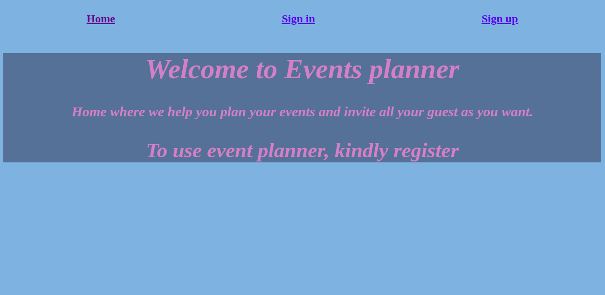

 

# Private events App

In this project, a user can create events, and can also attend many events. An event can be attended by many users.

In this project, we:

- Used Ruby to implement a private events clone webpage;
- Used HTML and SASS;
- Set up a code linter in the repository;
- Used gitflow;
- Created an effective Ruby code that solved the problem;
- Applied Ruby coding best practices;
- Implemented basic OOP principles;
- Have an organized project structure;
- Used common Ruby patterns;
- Chose a simple solution over a more complex one;
- Used RSpec with Capybara to test the models and requests.

## Built With

- Ruby
- Ruby on Rails 
- VSCode 
- Linters 
- HTML
- SASS
- RSpec

## Getting Started

- Clone the project to your local machine;
- `cd` into the project directory;
- Run `bundle install` to install the necessary gems;
- Run `rails db:create`;
- Run `rails db:migrate`;
- Run `rails s` to start a server in your computer;
- In your browser address, type the following URL: [localhost:3000](localhost:3000);
- Enjoy the App and its functionalities!

## Running RSpec tests

- `cd` into the project directory;
- Run `bundle exec rspec`.

## Authors

👤 **Author1**
Aremu Lucky
- Github: [@githubhandle](https://github.com/Luckyaremu)
- Twitter: [@twitterhandle](@luckyaremu)
- Linkedin: [linkedin](https://www.linkedin.com/in/lucky-aremu-24807a145/)

👤 **Author2**
Murilo Roque Paiva da Silva
- Github: [@muriloroque](https://github.com/MuriloRoque)
- Twitter: [@MuriloRoquePai1](https://twitter.com/MuriloRoquePai1)
- Linkedin: [MuriloRoque](https://www.linkedin.com/in/murilo-roque-b1268741/)

## 🤝 Contributing

Contributions, issues and feature requests are welcome! Start by:

Forking the project.
Cloning the project to your local machine.
cd into the project directory.
Run git checkout -b your-branch-name.
Make your contributions.
Push your branch up to your forked repository.
Open a Pull Request with a detailed description to the development branch of the original project for a review.

## Show your support

Give a ⭐️ if you like this project!

## Acknowledgments

- (https://www.theodinproject.com/courses/ruby-on-rails/lessons/associations)
